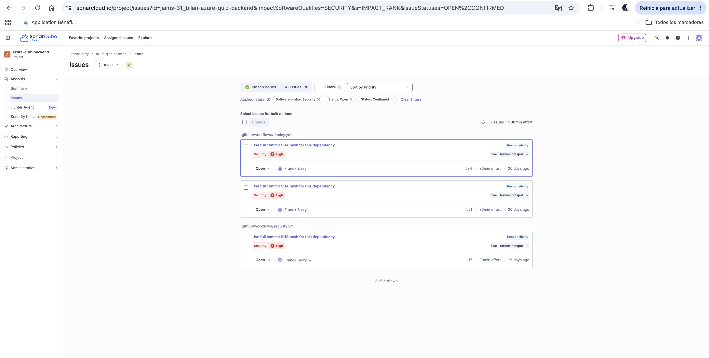
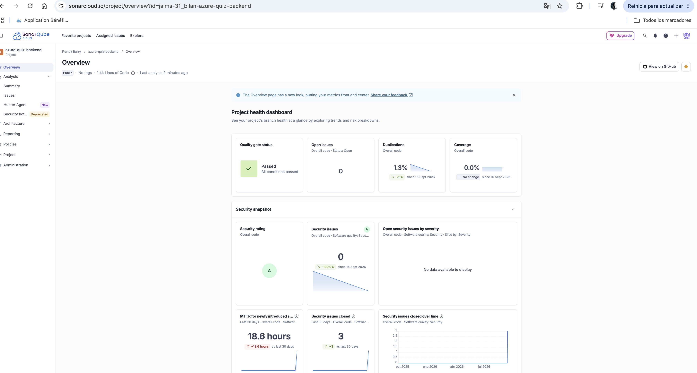

# azure-quiz-backend

Spring Boot REST API for the Azure certifications revision app (AZ-900 for now, more can be added later).

## Stack

- Java 21, Spring Boot 3.5.x, Maven
- Spring Web, Spring Data JPA, PostgreSQL, Flyway, Bean Validation, Lombok, Actuator
- Spring Data Redis (cache)
- Spring Cloud Azure Storage Blob (quiz result export)
- springdoc-openapi (Swagger UI)
- Tests: JUnit 5, Mockito, AssertJ

## Running locally

Prerequisites: JDK 21, Docker running.

```bash
./mvnw spring-boot:run
```

This starts Postgres, Redis and Azurite (local Azure Storage emulator) automatically, then the API on http://localhost:8080.

If you'd rather manage the containers yourself:

```bash
docker compose up -d
./mvnw spring-boot:run
```

Flyway runs the migrations on startup (AZ-900 content, modules 1 to 6, plus 6 mock exams).

Swagger UI: http://localhost:8080/swagger-ui.html

## Tests

```bash
./mvnw test
```

## Environment variables (production)

| Variable | Description |
|---|---|
| `SPRING_DATASOURCE_URL` | PostgreSQL JDBC URL |
| `SPRING_DATASOURCE_USERNAME` | PostgreSQL user |
| `SPRING_DATASOURCE_PASSWORD` | PostgreSQL password |
| `APP_CORS_ALLOWED_ORIGINS` | Allowed frontend origin |
| `REDIS_HOSTNAME` | Redis host |
| `REDIS_PORT` | Redis port (default 6379) |
| `REDIS_PASSWORD` | Redis password |
| `REDIS_SSL_ENABLED` | `true` in prod, `false` locally |
| `BACKEND_API_KEY` | Shared secret with the frontend (`X-Api-Key` header) |
| `STORAGE_ACCOUNT_NAME` | Azure Storage account name |
| `STORAGE_CONTAINER_NAME` | Blob container for quiz result exports |
| `SPRING_PROFILES_ACTIVE` | Set to `prod` in Azure |

## Data model

`certification` → `module` → `question` → `answer_option`. A quiz session is linked to a certification (and a module in review mode).

## API

- `GET /api/certifications`
- `GET /api/certifications/{certificationId}/modules`
- `POST /api/quiz-sessions` — creates a session (`MODULE` or `EXAM` mode)
- `POST /api/quiz-sessions/{sessionId}/questions/{questionId}/answer`
- `GET /api/quiz-sessions/{sessionId}/result`
- `GET /api/quiz-sessions/{sessionId}/result/export`

## Out of scope

- Provisioning Azure infrastructure (done with Terraform, separate repo)
- Importing the real question content

## Security

5 security scans run automatically on every Pull Request:

- SAST with SonarCloud (checks the source code)
- SCA with Trivy (checks dependencies for known CVEs)
- Secrets with Gitleaks (checks nothing was committed by mistake)
- Container & IaC with Trivy (checks the Dockerfile and the Docker image)
- DAST with OWASP ZAP (attacks the running app to find issues)

### What we found and fixed

- PostgreSQL driver had a known vulnerable version, updated to 42.7.12
- Netty and Tomcat in the Docker image were also vulnerable, updated
- SonarCloud found 3 GitHub Actions not pinned to a commit SHA in deploy.yml and security.yml. Fixed, security rating went from C to A.

Before:


After:
